# Feijiang Han's Portfolio

## About Me

I am a final year computer science student at Central South University with a strong academic background and practical experience in software development and data science. 

* GPA: 3.85/4.0
* Research topic: High-Performance System (distributed & parallel platform), Crowdsouring, AI, Internet of Things
* Interests: **Crowdsouring**, **High-Performance System** (distributed & parallel platform), **AI** (DL, ML, CV), **Internet of Things**
* Supervisor: Prof. Xu liu, Prof. Ying Zhao, Prof. Anfeng Liu, Phd. Qidong Zhao

## Skills

* **Programming Language:** Proficient in C/C++, Web Assembly, Python, JavaScript, Html/CSS; Familiar with Shell, Go
* **Framework:** Proficient in React, Vue, D3.js, PyTorch; Familiar with MPI, OpenMP, Django, Ajax
* **Other Skill Set:** Proficient in Git, Linux, Docker

## Projects

### [EasyView - Profiling Tool for Golang Applications](https://www.easyview.dev/)

* **C++; Web Assembly; JavaScript; React; WebGL**
* I developed EasyView, a profiling tool specifically designed for Golang applications. This tool allowed Golang engineers within the company to effectively analyze large-scale applications. EasyView supported the parsing of profiles and DrCCprofile in Protocol Buffers format. To make EasyView accessible to a wider audience, I launched the EasyView plugin on the VSCode extension marketplace, which received positive feedback and garnered 1,000 downloads.
* To enhance the performance of EasyView, I optimized the file parsing process by addressing bottlenecks and eliminating lag issues. This was achieved by incorporating C++/WebAssembly into JavaScript, resulting in a significant 20% reduction in parsing time.
* In order to overcome the 32-bit WASM memory limitation, I implemented an innovative two-level storage architecture using indexedDB. This allowed for efficient profiling of huge codebases exceeding 4GB in size.
* Furthermore, I improved the profiling speeds by an additional 10% through the implementation of a block-based LRU algorithm and bitmap dirty checking logic. These optimizations intelligently streamlined disk I/O and memory usage, resulting in faster and more efficient profiling operations.

* 这里是在大数据集上的展示效果

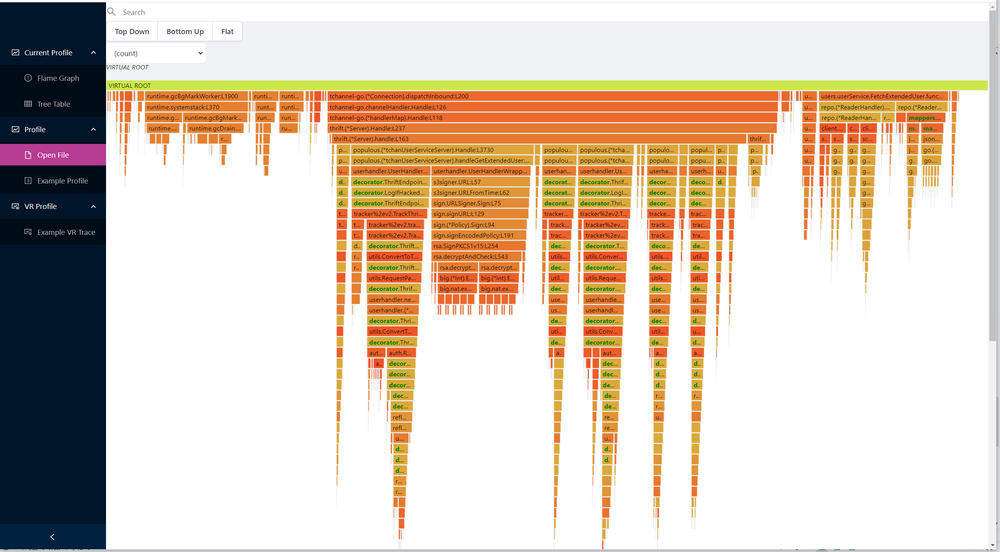

* 支持点击节点并展开子节点

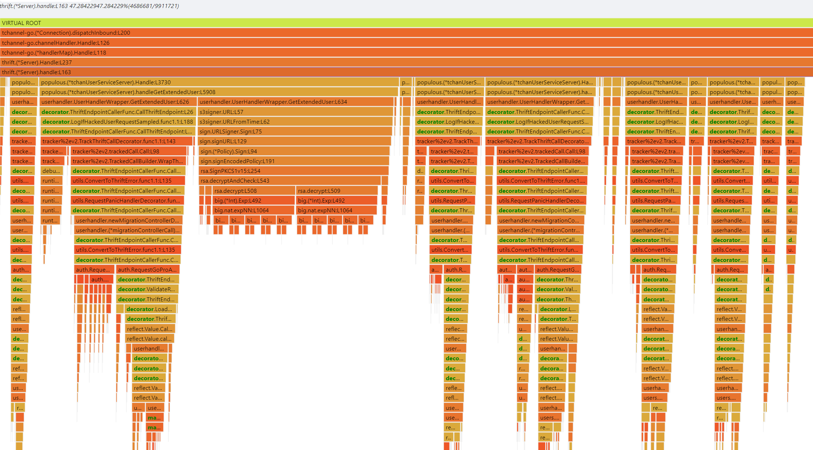

### [Pulmonary Embolism Detection Syste](https://github.com/FeijiangHan/CT-image-segmentation-for-pulmonary-embolism/)

* **Python & Pytorch & OpenCv & Cuda**
* As team leader, I led a 5-member group to develop a CT image detection model for identifying pulmonary embolisms. We built an ensemble model combining YOLO and UNet that achieved top 5% ranking in a Kaggle competition, improving on the UNet baseline by 8%. I spearheaded innovative data augmentation techniques that expanded our training dataset by 30%.

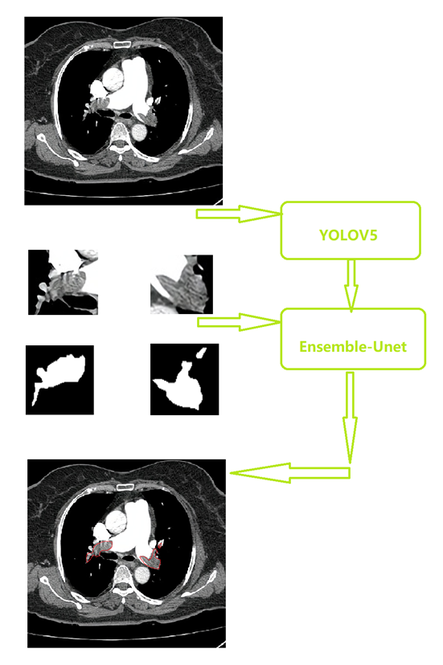

* 使用图像拼接扩增图像，提高小目标占比

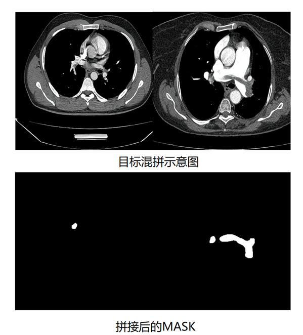

* 图像增强算法

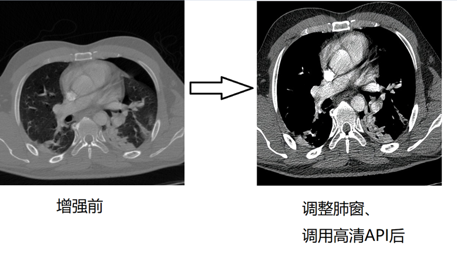

* 下面是最终检测结果

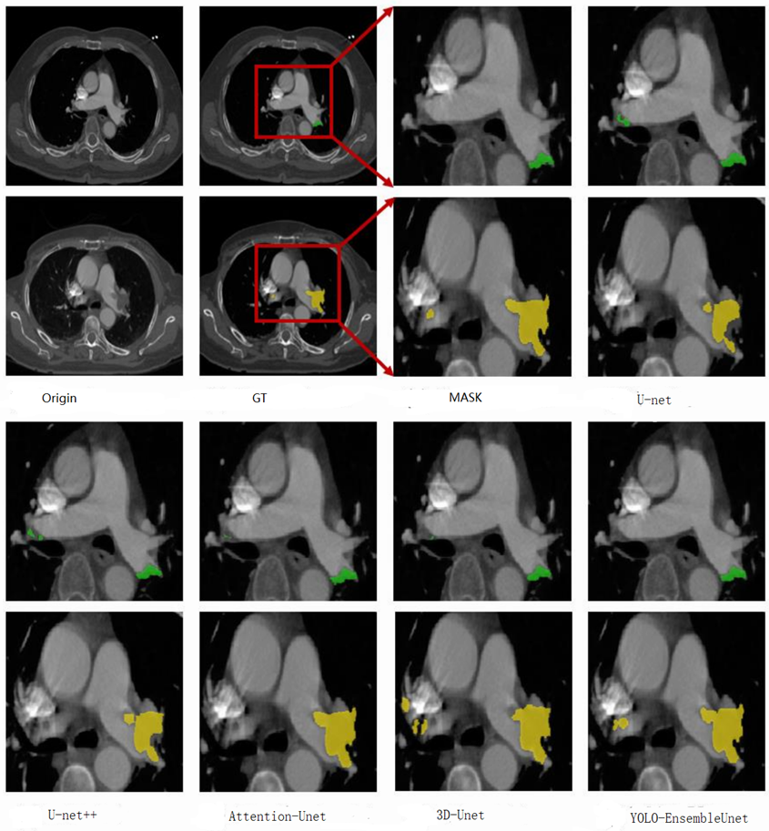

### Web Shell Detection and Visualization [GitHub](https://github.com/FeijiangHan/Malware-Family-Vis-Platform/)

* **D3.js & React & Redux & Django**
* I enhanced clustering algorithms to identify malicious web shell families from a dataset of 561K function calls with 100% accuracy. Using React and Django, I built a real-time model training platform that allowed analysts to refine the clustering model interactively. A related patent was published.

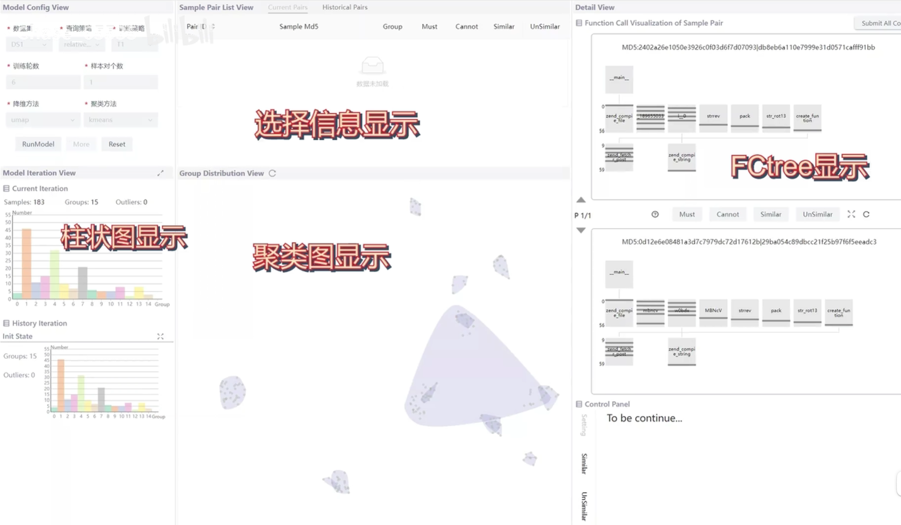

* 训练一轮后：

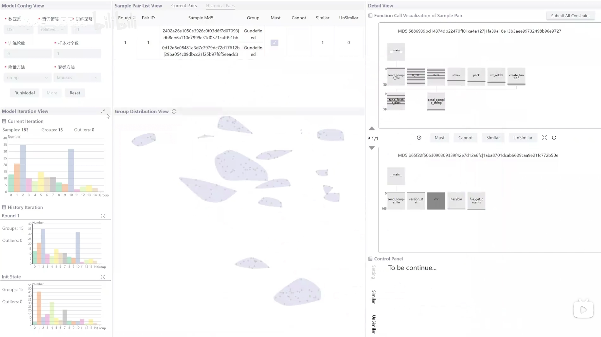

### Innovative Function Call Visualization [Paper](https://github.com/FeijiangHan/openPaper/blob/main/Fctree.pdf)

* **D3.js & Vue & Django**
* I proposed FCTree, a novel technique to visualize function calls during execution. Using Vue and d3.js, I built an interactive web prototype and demonstrated its effectiveness through user studies. A related patent was published.

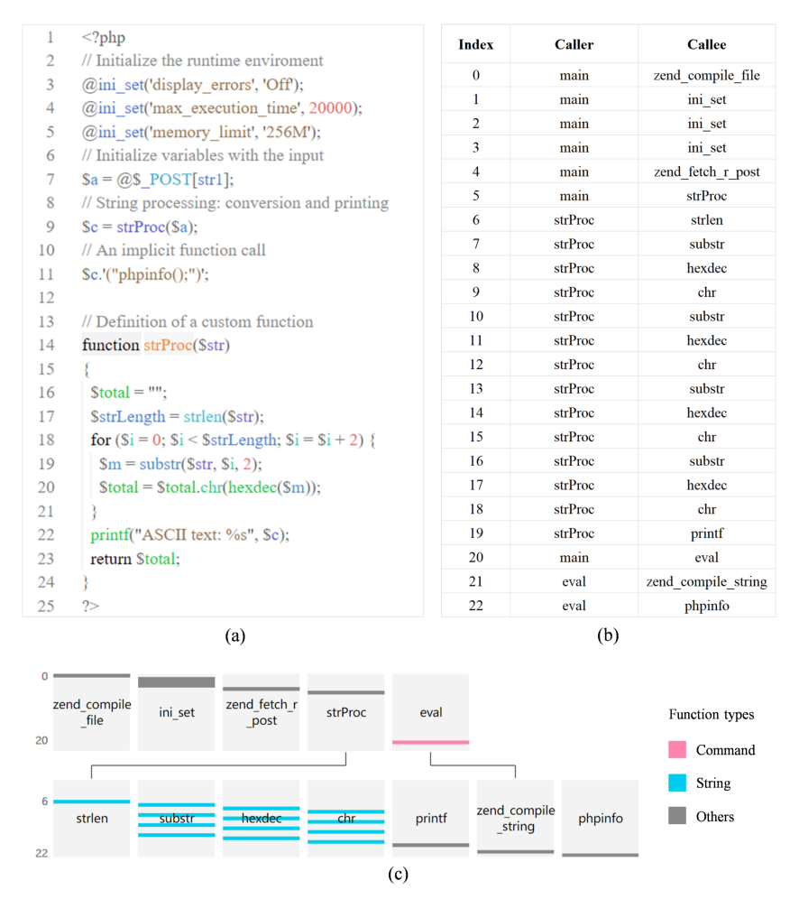

* 下面是FCtree在不同数据集上的可视化

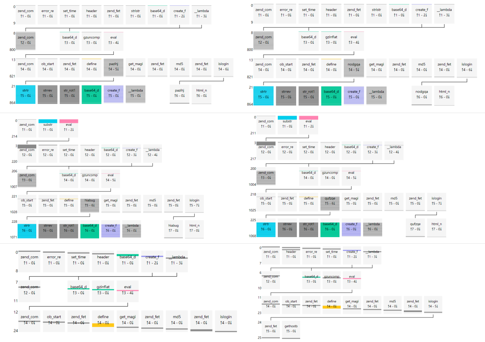

* 实现了动态链路交互功能，可以显示选择节点的调用链路

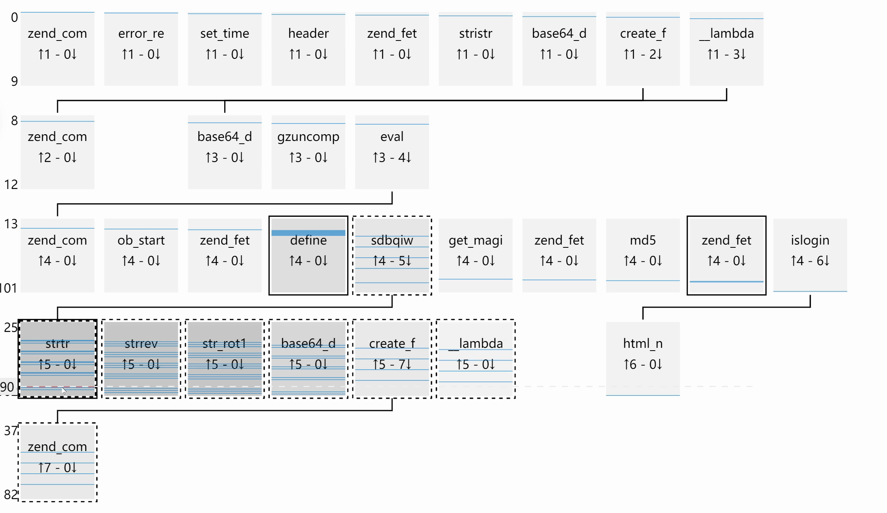

* 可以动态显示函数调用次数和时序

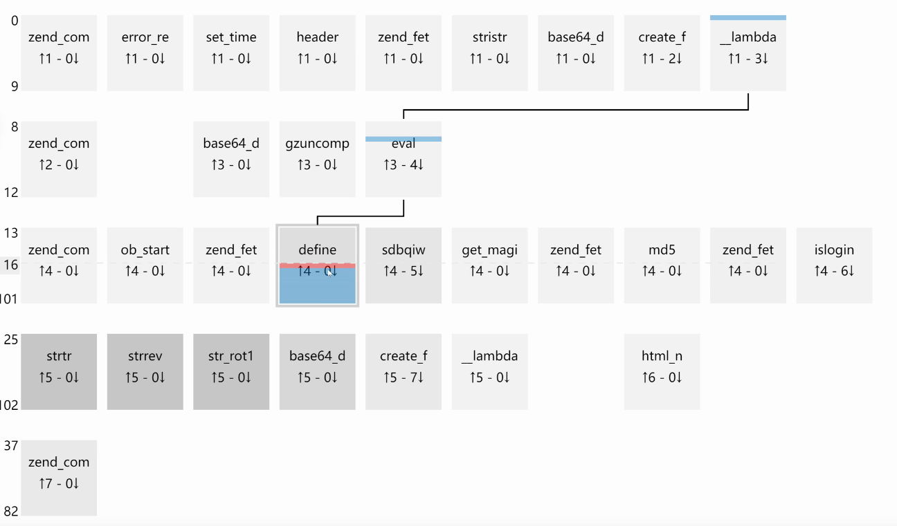

## Working Experience

**Matrix Origins Inc.**

*Database Kernel Development Intern*

- As a Database Kernel Development Intern at Matrix Origins Inc., I have been responsible for maintaining a deployed distributed database kernel. During my time there, I successfully refactored high-performance index structures, resulting in the deployment and release of three new features.
- To ensure the quality and reliability of the database kernel, I utilized GoogleTest for unit testing and PingCode for bug management. Additionally, I performed code scans using Sonar and Cppcheck to identify areas for improvement. This included addressing low GoogleTest coverage and promptly making necessary corrections.
- In order to support ongoing development and the onboarding of new engineers, I co-authored technical documentation, manuals, and design documents in both Chinese and English.

**Beijing SINA Information Technology** 

*Software Engineer Intern*  

* During my internship as a Software Engineer at Beijing SINA Information Technology Co., Ltd., I worked on various projects to enhance performance and efficiency.

* One notable achievement was the development of an optimized Trie data structure using WebAssembly. This data structure replaced regular expressions in JavaScript for high-performance keyword matching. By implementing parallel processing with 8 processes, the time required for keyword matching was reduced from 8 hours to just 10 minutes.
* I also partitioned a 1TB user log dataset using a hash algorithm and distributed the data across 10 machines. Additionally, I constructed a dynamic hash table to efficiently handle keyword statistics.
* Furthermore, I implemented a feature to match the top 50 high-frequency keywords in webpage text. This involved inserting hyperlinks and video links to improve navigation and enhance the user experience.

**ChatPaper Team**

*Open Source Contributor*

* As an Open Source Contributor to the ChatPaper project on GitHub, I have made significant contributions to this popular open-source project.
* Among my contributions, I have developed and tested three sub-features, further enhancing the functionality of ChatPaper. Additionally, I have been working on developing multi-paper comparison views and generating potential innovative ideas using GPT 3.5 (currently under testing).
* I integrated SVG mind maps based on Markdown and utilized PyPDF2 to support the uploading and parsing of PDF files. Furthermore, I integrated Firebase to enable third-party authentication methods, such as Google login and phone number login.

## Honors & Awards

- Xiaomi Outstanding Scholarship, Xiaomi Public Welfare Foundation, 2023 **(only 10 awards university-wide)**
- Undergraduate first Grade Scholarship, CSU, 2023 **(top 2%)**
- National Scholarship, CSU, 2021, 1st in major **(rank 1)**
- M Award, Mathematical Contest in Modeling (MCM), 2023
- National 2st Prize, Chinese College Students Computer Design Contest, 2023
- 1st Prize, Competition of Service Outsourcing and Entrepreneurship Innovation, 2022

## Publications

* J. Tang, **F. Han**, K. Fan, W. Xie, P. Yin, Z. Qu, [Credit and Quality Intelligent Learning based Multi-armed Bandit Scheme for Unknown Worker Selection in Multimedia MCS](https://www.sciencedirect.com/science/article/abs/pii/S0020025523010290). *Information Sciences*. Volume 647, November 2023, 119444* (Co-1st author, JCR Q1, IF=8.1)
* J. Tang, K. Fan, W. Xie, **F. Han**, [BTV-CMAB: A Bi-directional Trust Verification Based Combinatorial Multi-Armed Bandit Scheme for Mobile Crowdsourcing](https://www.sciencedirect.com/science/article/abs/pii/S0020025523010290). IEEE Internet of Things Journal. (JCR Q1, IF=10.238)
* J. Tang, K. Fan, W. Xie, **F. Han**, Pengzhi Yin, Zhenzhe Qu, [A Semi-supervised Sensing Rate Learning based CMAB Scheme to Combat COVID-19 by Trustful Data Collection in the Crowd](https://www.sciencedirect.com/science/article/pii/S0140366423001433). *Computer Communications.* *Volume 206, 1 June 2023, Pages 85-100* (JCR Q1, IF=6.0)
* **F. Han**, Y. Zhao, S. Lv, [FCTree: Visualization of Function Calls in Execution](https://github.com/FeijiangHan/openPaper/blob/main/Fctree.pdf) (Frontiers of Computer Science, Revised status)
* **F. Han**, J. Tang, K. Fan, W. Xie, [Minority is all you need: Eliciting the Minority Report in Crowdsourcing](https://github.com/FeijiangHan/openPaper/blob/main/Minority Report is All your need.pdf). (AAAI second stage, under review) 
* J. Tang, Y. Yuwei, **F. Han**, MAB-RP: A Multi-Armed Bandit based Scheme for Accurate Data Collection in Crowdsensing. (Resubmitted to Information Sciences, under review)
